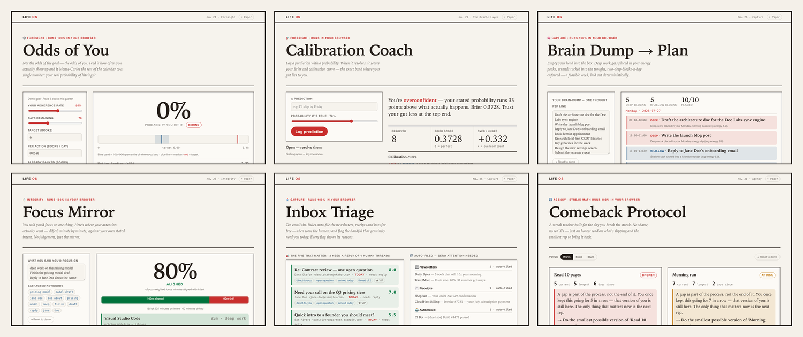

<!--
  GitHub Profile README for @sachinai1981-web
  Repo must be named EXACTLY "sachinai1981-web" (same as username) with README.md at root.
  Hero image lives at ./assets/life-os.png in this same repo.
-->

<h1 align="center">Hi, I'm Sachin Rai 👋</h1>

  <b>Enterprise sales by day · local-first AI tools by night 🌙</b>

  I build software that thinks about your life and <b>never phones home</b> — 
  where a language model only ever <i>narrates</i>, and every number is deterministic code you can audit.

  
  
  

---

## 🧬 Life OS — thirty local-first apps on one shared spine

  

Thirty small apps that run **100% in your browser** — no server, no account, **zero network calls**. One idea underneath all of them: **the model narrates, the math decides.** Streaks, forecasts, calibration scores, energy-aware schedules, priority triage — all deterministic, all auditable, and **each one its own repo you can download or fork.**

| | | |
|---|---|---|
| 🎲 **[Odds of You](https://sachinai1981-web.github.io/life-os-odds-of-you/)** — your real probability of hitting a goal, Monte-Carlo'd from your show-up rate | 🎯 **[Calibration Coach](https://sachinai1981-web.github.io/life-os-calibration-coach/)** — score your predictions; see how over/under-confident you really are | 🧠 **[Brain Dump → Plan](https://sachinai1981-web.github.io/life-os-brain-dump-plan/)** — a messy list becomes a feasible week, deep work in your peaks |
| 📥 **[Inbox Triage](https://sachinai1981-web.github.io/life-os-inbox-triage/)** — auto-file the noise, flag the five emails that need you | 🪞 **[Focus Mirror](https://sachinai1981-web.github.io/life-os-focus-mirror/)** — where your attention actually went vs. where you said it would | 🔁 **[Comeback Protocol](https://sachinai1981-web.github.io/life-os-comeback-protocol/)** — a streak tracker built for the day you *break* the streak |

<b>…and 24 more →</b> <a href="https://github.com/sachinai1981-web?tab=repositories&q=life-os&type=source"><b>Browse all 30 Life OS repos</b></a> · each is a downloadable single-file app

---

## 🚀 More things I've built

| Project | What it is | Stack |
|---|---|---|
| **🧬 [Life OS](https://github.com/sachinai1981-web?tab=repositories&q=life-os&type=source)** | 30 local-first apps, each its own downloadable repo — the model narrates, the math decides | HTML · Vanilla JS |
| **focus-forecast** | Pomodoro PWA that forecasts tomorrow's focus with TimesFM | PWA · TimesFM |
| **Jot / focuscard-ios** | A local-first native iOS notes + planner app | Swift · Expo |
| **notion-mcp-server** | MCP server connecting Claude to the Notion API | Node · TypeScript |
| **AutoQuant · Bull** | Momentum trading research — signal discovery & backtests | Python · Alpaca |

---

## 📊 GitHub Stats

  
  

---

## 🧰 Languages & Tools

  
  
  
  
  
  

  
  
  
  
  

  
  
  
  
  

---

<i>⚡ Building in the open, one small local-first app at a time.</i>

<!-- refresh -->
